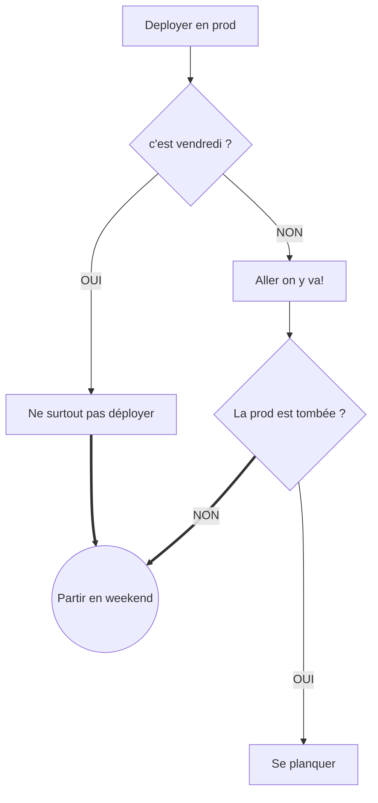
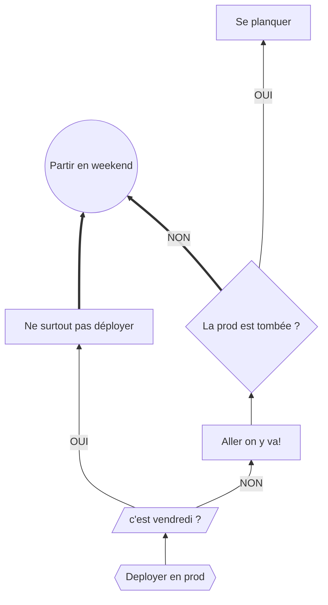
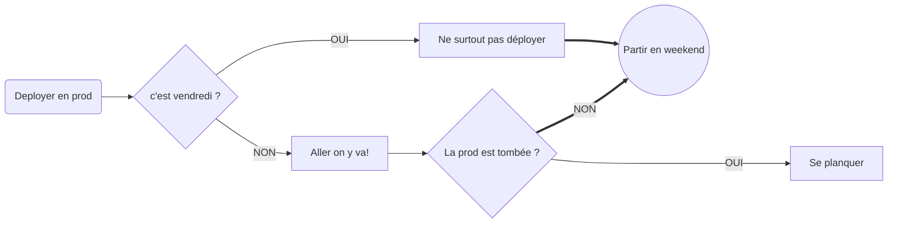
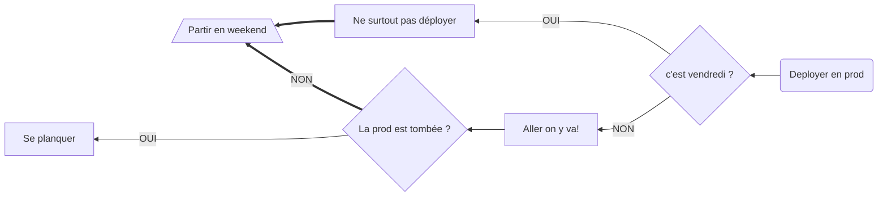

# Flowchart
## Top -> Bottom

```mermaid
  flowchart TB
      A[Deployer en prod]-->B{c'est vendredi ?};
      B -- OUI --> C[Ne surtout pas déployer];
      C ==> G;
      B -- NON --> D[Aller on y va!];
      D--> E{La prod est tombée ?};
      E -- OUI ----> F[Se planquer];
      E == NON ==> G((Partir en weekend));
```

## Bottom -> Top

```mermaid
  flowchart BT
      A{{Deployer en prod}}-->B[/c'est vendredi ?/];
      B -- OUI --> C[Ne surtout pas déployer];
      C ==> G;
      B -- NON --> D[Aller on y va!];
      D--> E{La prod est tombée ?};
      E -- OUI ----> F[Se planquer];
      E == NON ==> G((Partir en weekend));
```

## Left -> Right

```mermaid
  flowchart LR
      A(Deployer en prod)-->B{c'est vendredi ?};
      B -- OUI --> C[Ne surtout pas déployer];
      C ==> G;
      B -- NON --> D[Aller on y va!];
      D--> E{La prod est tombée ?};
      E -- OUI ----> F[Se planquer];
      E == NON ==> G((Partir en weekend));
```

## Right -> Left

```mermaid
  flowchart RL
      A(Deployer en prod)-->B{c'est vendredi ?};
      B -- OUI --> C[Ne surtout pas déployer];
      C ==> G;
      B -- NON --> D[Aller on y va!];
      D--> E{La prod est tombée ?};
      E -- OUI ----> F[Se planquer];
      E == NON ==> G[/Partir en weekend\];
```