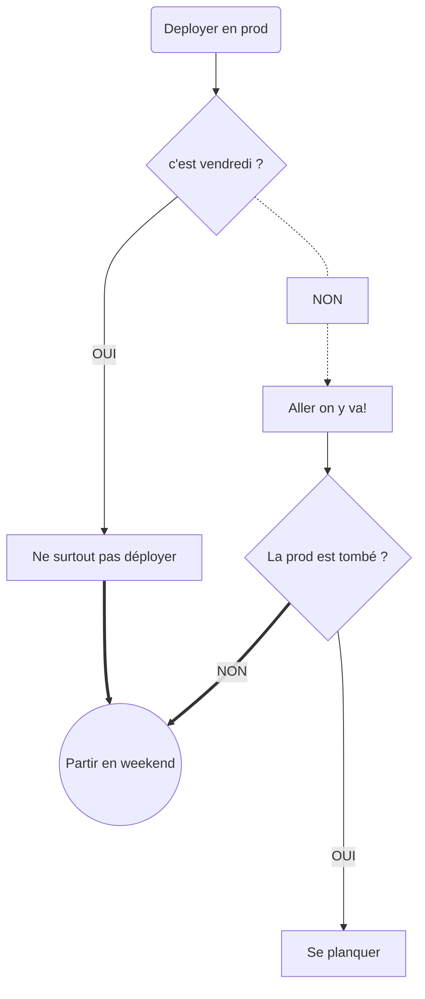

# Flowchart

```mermaid
  flowchart TB
      A(Deployer en prod)-->B{c'est vendredi ?};
      B -- OUI --> C[Ne surtout pas déployer];
      C ==> G
      B -.- NON -.-> D[Aller on y va!];
      D--> E{La prod est tombé ?};
      E -- OUI ----> F[Se planquer];
      E == NON ==> G((Partir en weekend));
```