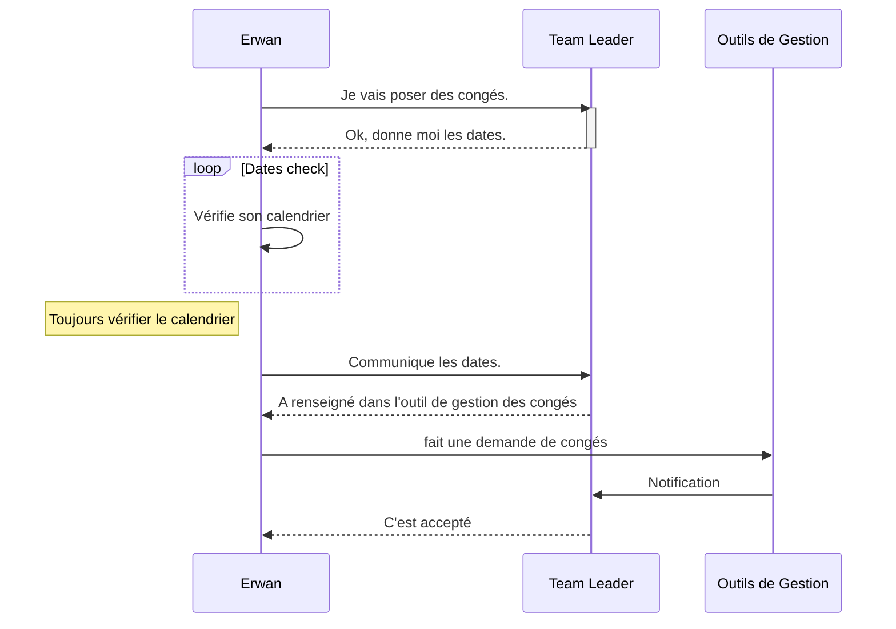

# Sequence

```mermaid
sequenceDiagram
    participant Erwan
    participant Team Leader
    Erwan ->> Team Leader: Je vais poser des congés.
    activate Team Leader
    Team Leader -->> Erwan: Ok, donne moi les dates.
    deactivate Team Leader
    loop Dates check
        Erwan ->> Erwan: Vérifie son calendrier
    end
    Note Left of Erwan : Toujours vérifier le calendrier
    Erwan->>Team Leader: Communique les dates.
    Team Leader -->> Erwan : A renseigné dans l'outil de gestion des congés
    Erwan ->> Outils de Gestion : fait une demande de congés
    Outils de Gestion ->> Team Leader : Notification
    Team Leader -->> Erwan : C'est accepté
```